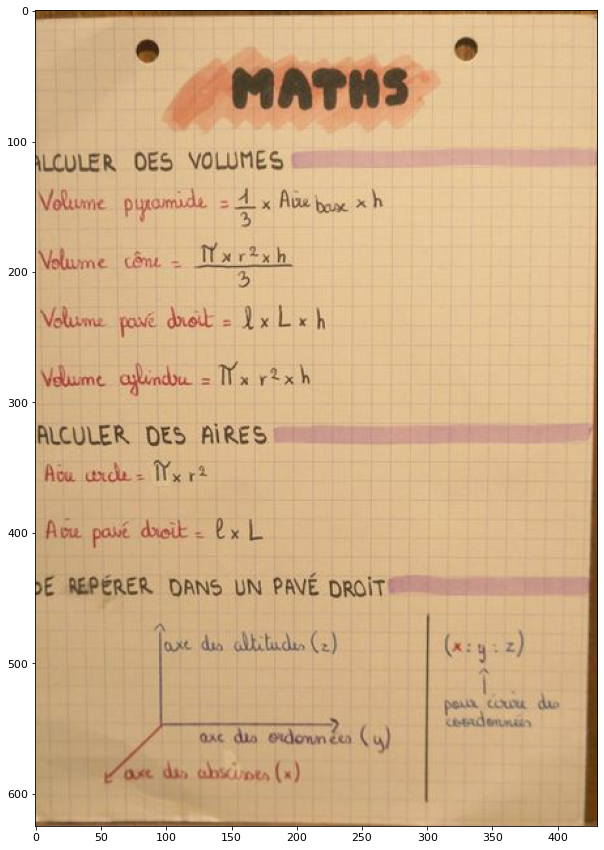

# Image-cropping-with-CV

crop images automatically with computer vision techniques

>framework  :Tensorflow 

>Data and bounding box augumentation : albumentations 

Original image             |  Croped image(Predicted)
:-------------------------:|:-------------------------:
  |  

## Results 

| Model | Accuracy | mAP(0.5) | Inference time(s) |
| ------ | ------ | ------ | ------ |
| Yolov5 | 0.996 |  0.99 | 0.298 |
| custom neural network | 0.759 | 0.418 | 0.138 |
| ssd mobile net Tensorflow | 0.987 | 0.817 | 0.08 |
